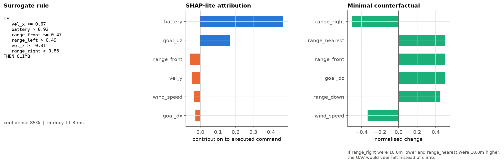
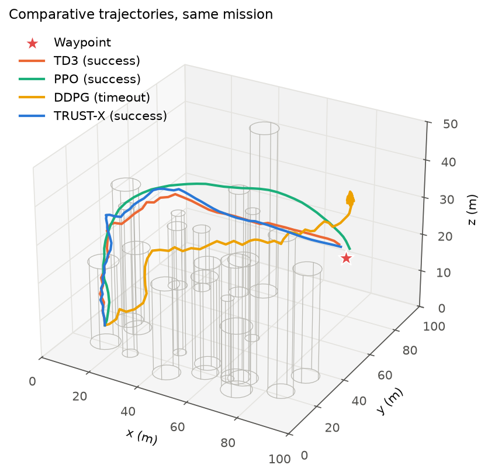
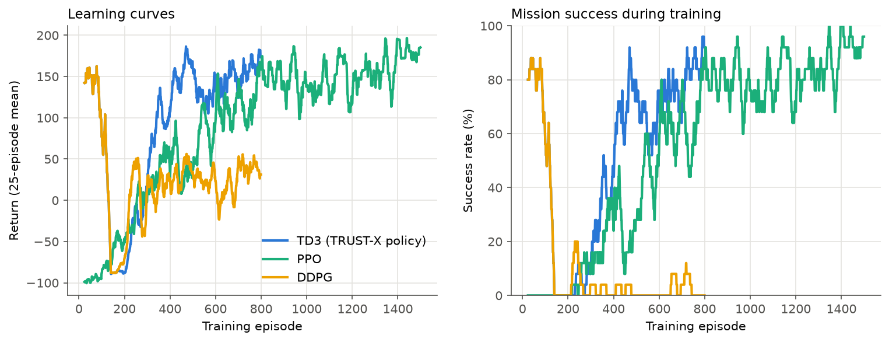
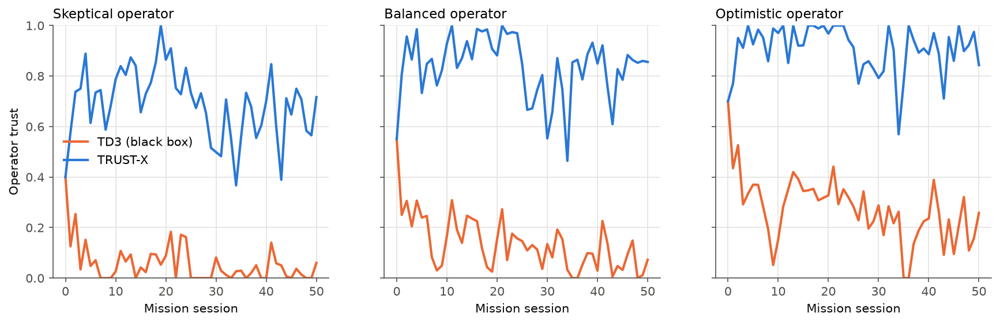
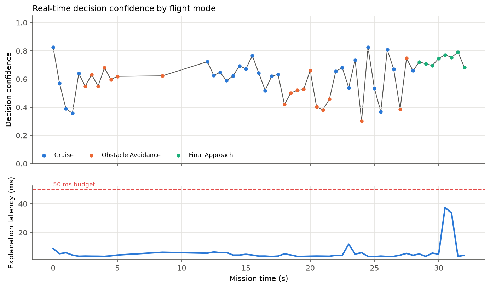
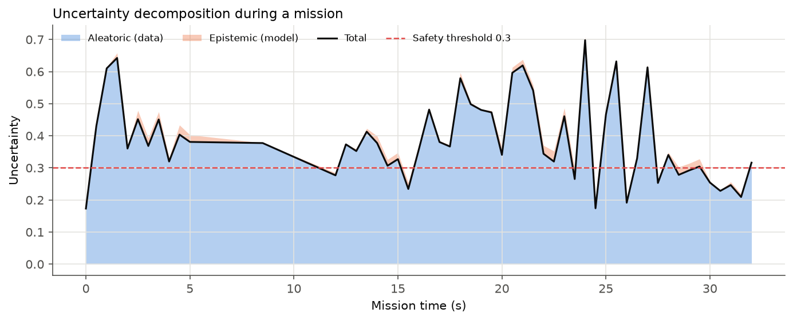

# TRUST-X: Real-Time Explainable Decision-Making for RL-Based UAV Control

[](https://github.com/inayatarshad/DRL-trust_x-drones/actions/workflows/ci.yml)


Reference implementation of **TRUST-X** ([paper](docs/TRUST-X_paper.pdf)). TRUST-X is an explainability and
trust-calibration layer for deep reinforcement learning (DRL) drone controllers. A TD3 agent learns to fly through a
3D city. For every decision, TRUST-X explains:

* **what** the drone does and under which conditions, as a *surrogate decision-tree rule*
* **why**, as the top-3 *SHAP-lite* feature attributions
* **why not something else**, as a *minimal counterfactual* from the contrastive explanation mechanism
* **how sure** the policy is, as a *decision confidence* with aleatoric/epistemic uncertainty

Explanations are generated in milliseconds. A *Bayesian trust model* reads the operator's feedback
(Trusted / Unclear / Disagree) and adapts how detailed the explanations are, switching to a safe mode when trust
or confidence drops.

```
--- t=  6.0s  pos=[26.6 39.6 30.1]  dist= 73.1 m  level=detailed  latency=12.2 ms
Action: ADVANCE (confidence 70%)
Rule: IF vel_y > 0.49 AND battery > 0.95 AND range_front <= 0.66 AND ... THEN ADVANCE
Key factors: vel_y (+0.25), range_front (-0.19), battery (+0.16)
Contrast: If range_front were 9.3m higher and goal_dz were 22.4m higher, the UAV would veer left instead of advance.
Operator tag: Trusted  ->  estimated trust 0.58 (true 0.44)
```
<sub>Real output of `python -m scripts.explain_demo --profile skeptical` with the released TD3 checkpoint (one step, rule shortened).</sub>

---

## Contents

- [Architecture](#architecture)
- [Quick start](#quick-start)
- [Reproducing the experiments](#reproducing-the-experiments)
- [Results](#results)
- [Repository layout](#repository-layout)
- [Relation to the paper](#relation-to-the-paper)
- [Citation](#citation)

## Architecture

```
 UAV environment ──s_t──▶ TD3 policy ──a_t──▶ environment          (or the operator's override)
                              │
                              ▼
            ┌──────── TRUST-X explainer (< 50 ms) ────────┐
            │ surrogate tree  →  IF-THEN rule  (R² fidelity)│
            │ SHAP-lite       →  top-3 factors              │
            │ contrastive     →  minimal counterfactual     │
            │ uncertainty     →  confidence, aleatoric/epist│
            └───────────────┬───────────────────────────────┘
                            ▼ explanation at the trust-selected level
                        operator ──tag Z_t∈{-1,0,1}──▶ Kalman trust filter ──▶ τ̂_t
                            │                                    │
                            └── override when risk ∧ low trust   └─▶ granularity + safe mode
```

A component-by-component mapping to the paper's equations is in [`docs/architecture.md`](docs/architecture.md).

| Module | Paper | What it does |
|---|---|---|
| [`trustx/envs/uav_env.py`](trustx/envs/uav_env.py) | Sec. V-A | 100×100×50 m city, wind up to 15 m/s, fog, battery, σ=0.05 sensor noise |
| [`trustx/agents/`](trustx/agents) | Eqs. 3–7 | TD3 (main policy), plus DDPG and PPO baselines, in PyTorch |
| [`trustx/explain/surrogate.py`](trustx/explain/surrogate.py) | Sec. IV-B, Eq. 19 | Decision tree distilled from 10k state–action pairs; rules + R² fidelity |
| [`trustx/explain/shap_lite.py`](trustx/explain/shap_lite.py) | Eqs. 11–12 | Monte Carlo permutation Shapley values (M=100), one batched call |
| [`trustx/explain/cem.py`](trustx/explain/cem.py) | Eqs. 13–14 | Sparse, bounded counterfactuals via proximal projected gradient descent |
| [`trustx/explain/uncertainty.py`](trustx/explain/uncertainty.py) | Figs. 6–7 | Aleatoric (sensor noise) vs. epistemic (twin-critic disagreement) |
| [`trustx/trust/bayesian.py`](trustx/trust/bayesian.py) | Eqs. 15–16 | Trust likelihood, exact grid filter and real-time Kalman filter |
| [`trustx/trust/operator.py`](trustx/trust/operator.py) | Eq. 17, Fig. 8 | Simulated skeptical / balanced / optimistic operators |
| [`trustx/evaluation.py`](trustx/evaluation.py) | Alg. 1, Eq. 18 | Human-in-the-loop missions, interventions, McNemar and paired t-tests |

## Quick start

```bash
git clone https://github.com/inayatarshad/DRL-trust_x-drones.git
cd DRL-trust_x-drones
pip install -e ".[dev]"
pytest -q                     # tests for the environment, agents, explainers and trust model
```

Trained checkpoints are included in `checkpoints/`, so you can run the explanation demo right away:

```bash
python -m scripts.explain_demo --profile skeptical
```

Use the library directly:

```python
from trustx.agents import load_agent
from trustx.envs import make_env
from trustx.framework import TrustXExplainer

env = make_env()
agent = load_agent("checkpoints/td3/model.pt")
explainer, fidelity = TrustXExplainer.build(agent, env)   # distils the surrogate tree

obs, _ = env.reset(seed=0)
explanation = explainer.explain(obs, level="detailed")
print(explanation.text())
```

## Reproducing the experiments

```bash
# 1. train the policies (CPU only; roughly 15-45 min each)
python -m scripts.train --config configs/td3.yaml
python -m scripts.train --config configs/ddpg.yaml
python -m scripts.train --config configs/ppo.yaml

# 2. Table I + ablations: 20 simulated operators x 50 missions per method
python -m scripts.evaluate --operators 20 --missions 50

# 3. figures
python -m scripts.make_figures
```

Any config value can be overridden from the command line, for example `train.episodes=200 env.n_waypoints=3`.

## Results

All numbers below come from `python -m scripts.evaluate --operators 20 --missions 50`. They are stored in
[`results/table1.md`](results/table1.md) and [`results/evaluation.json`](results/evaluation.json). Every method
flies the **same 1,000 missions** in front of the **same 20 simulated operators** (skeptical, balanced and
optimistic profiles), so the comparisons are paired.

### Table I: human-in-the-loop comparison

| Method | Success (%) | Missions with intervention (%) | Interventions / mission | Operator trust Δ (pp) | Clarity* (1–5) | Latency mean / p95 (ms) |
|---|---|---|---|---|---|---|
| TD3 (black box) | **89.0** | 87.3 | 2.42 | −40.7 | 2.00 | – |
| PPO (black box) | 88.4 | 71.9 | 1.79 | −30.0 | 2.00 | – |
| DDPG (black box) | 7.1 | 90.0 | 3.79 | −43.5 | 2.00 | – |
| **TRUST-X** (TD3 backbone) | 77.7 | 6.4 | 0.14 | +27.1 | 4.57 | 12.2 / 43.5 |
| **TRUST-X** (PPO backbone) | 81.5 | **2.7** | **0.05** | **+34.8** | **4.81** | 6.8 / 13.8 |

<sub>*Clarity is a simulated rating derived from explanation quality. A black box scores 2.0 by construction.
Policy-only success with no operator in the loop: TD3 83.2%, PPO 82.8%, DDPG 2.0% (500 missions).</sub>

### Ablations (TRUST-X, TD3 backbone)

| Variant | Success (%) | Interventions / mission | Trust Δ (pp) | Latency mean (ms) |
|---|---|---|---|---|
| Full TRUST-X | 77.7 | 0.14 | +27.1 | 12.2 |
| w/o contrastive explanations (CEM) | 80.4 | 0.70 | +15.0 | 2.6 |
| w/o SHAP-lite | 80.5 | 0.77 | +15.8 | 11.1 |
| w/o adaptive granularity | 77.1 | 0.12 | +29.4 | 11.9 |
| w/o safe mode | 81.1 | 0.18 | +26.5 | 11.0 |

### What the results show, including what did not work

* **Interventions drop by about 94% and trust rises instead of falling.** With TRUST-X, operators take manual
  control in 6% of missions instead of 87%, and their trust goes up by 27 pp instead of down by 41 pp.
  Removing either CEM or SHAP-lite roughly halves the trust gain and multiplies interventions by about 5.
  Both explanation types matter in this model, which matches the paper's ablation finding for CEM.
* **Real-time budget is met.** The mean explanation latency is 12 ms, and the 95th percentile is 43.5 ms,
  under the 50 ms budget, on a laptop CPU.
* **Mission success is *lower* with TRUST-X (77.7% vs 89.0%)**, which is the opposite of the paper's claim. Two
  effects explain it. Black-box baselines are frequently rescued by operator overrides (the fallback controller
  is a decent pilot). TRUST-X's safe mode also slows the drone whenever estimated uncertainty exceeds 0.3,
  which happens too often (see Fig. 7); removing safe mode recovers 3.4 pp. Calibrating the uncertainty
  threshold is the obvious next step.
* **Surrogate fidelity depends on the policy.** A depth-8 tree reaches R² = **0.85** on the PPO policy but only
  **0.38** on TD3, whose commands are jittery. Smoothness-regularised TD3 raises fidelity to about 0.8 but costs
  most of its mission success ([`results/smoothness_tradeoff.md`](results/smoothness_tradeoff.md)). The paper's
  91% fidelity is not reproduced for TD3.
* **Adaptive granularity has no measurable effect** in this operator model (77.1% vs 77.7%, p = 0.52).
* SHAP-lite often ranks `battery` highly. The policy uses state of charge as a proxy for elapsed mission time,
  which is exactly the kind of shortcut these explanations exist to expose.

### Figures

| | |
|---|---|
|  |  |
| **Fig. 2** Rule, SHAP-lite attribution and counterfactual for one decision | **Fig. 4** Same mission flown by every method |
|  |  |
| **Fig. 5** Learning curves. Early off-policy success comes from demonstration warm-up | **Fig. 8** Operator trust over 50 missions per profile |
|  |  |
| **Fig. 6** Decision confidence by flight mode, and latency. Gaps are manual overrides | **Fig. 7** Aleatoric vs. epistemic uncertainty |


## Repository layout

```
trustx/                 library
  envs/                 UAV environment + safe fallback controller
  agents/               TD3, DDPG, PPO, replay buffer
  explain/              surrogate tree, SHAP-lite, CEM, manoeuvres, uncertainty
  trust/                Bayesian trust filters, simulated operators
  framework.py          TrustXExplainer (explanation E_t)
  evaluation.py         Algorithm 1 mission loop + statistics
  training.py           training loops
scripts/                train / evaluate / make_figures / explain_demo
configs/                YAML configs (environment + per-algorithm)
checkpoints/            trained models and training logs
results/                evaluation tables, JSON and figures
tests/                  pytest suite (run in CI)
docs/                   paper PDF and architecture notes
notebooks/              original figure prototyping notebook
```

## Relation to the paper

This repository is an open, runnable re-implementation of the TRUST-X framework. Some choices differ from the
paper's text, and each one is documented in [`docs/architecture.md`](docs/architecture.md):

* **Simulated operators.** The paper's human-centred metrics came from a user study (20 operators × 50 missions).
  Here, simulated operators follow the paper's own trust model (Eqs. 15 and 17). The trust, intervention and
  clarity numbers therefore show how the closed loop behaves under those assumptions. They are **not** evidence
  about real people.
* **Numbers are measured, not copied.** Every number in the Results section is produced by the code in this
  repository and can be regenerated with the commands above. They differ from Table I of the paper. In
  particular, mission success and TD3 surrogate fidelity are lower than reported there (see above).
* **Observation design.** Obstacle distances are range-finder readings relative to the heading, and the goal is
  a tanh-scaled direction vector. This makes the navigation task learnable within a CPU budget.
* **Demonstration-seeded warm-up.** TD3 and DDPG fill their replay buffer with noisy demonstrations from a
  hand-written safe controller. Without them, the agents never observe the goal reward and learn only to hover.

## Citation

```bibtex
@inproceedings{akbar2025trustx,
  title  = {{TRUST-X}: Real-Time Explainable Decision-Making Framework for Reinforcement Learning-Based {UAV} Control},
  author = {Akbar, Hanzala and Arshad, Inayat and Rahman, Satwat and Aamir, Fatima and Fatima, Marrium and Khan, Haroon Ur Rashid},
  year   = {2025}
}
```

Released under the [MIT License](LICENSE).
